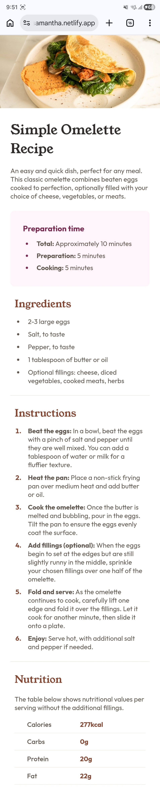
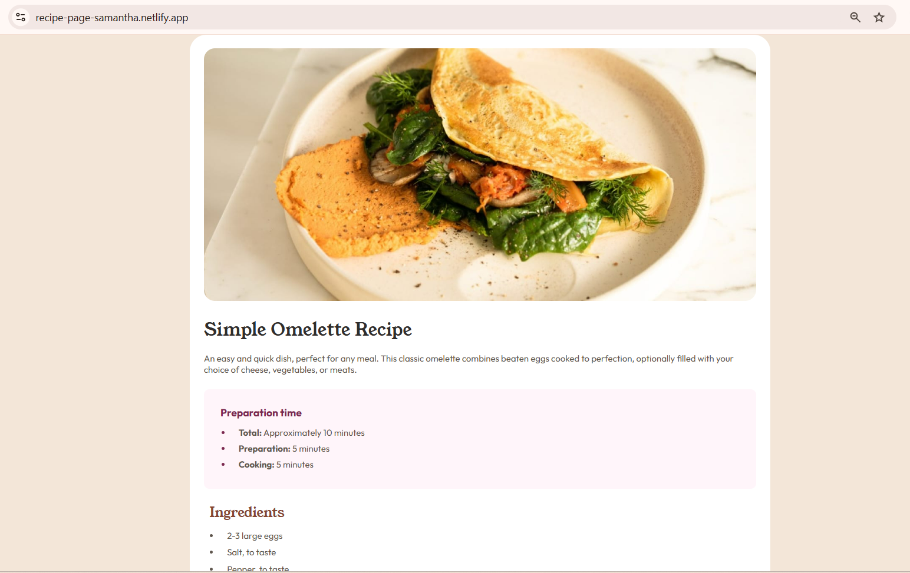
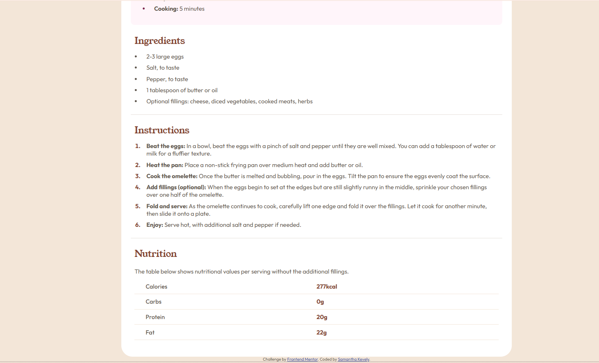

# Frontend Mentor - Recipe page solution

This is my solution to the [Recipe page challenge on Frontend Mentor](https://www.frontendmentor.io/challenges/recipe-page-KiTsR8QQKm). This project focuses on building a responsive layout using semantic HTML and CSS.

## Table of contents

- [Overview](#overview)
  - [Screenshot](#screenshot)
  - [Links](#links)
- [My process](#my-process)
  - [Built with](#built-with)
  - [What I learned](#what-i-learned)
  - [Continued development](#continued-development)
  - [AI Collaboration](#ai-collaboration)
- [Author](#author)
- [Acknowledgments](#acknowledgments)

## Overview

### Screenshot








### Links

- Solution URL: [Repipe Page Solution](https://www.frontendmentor.io/solutions/recipe-page-mobile-first-responsive-design-with-html-and-css-oJsk8Xrr3F)
- Live Site URL: [Recipe Page](https://recipe-page-samantha.netlify.app/)

## My process

### Built with

- Semantic HTML5
- CSS custom properties (variables)
- Mobile-first workflow
- Responsive design (media queries)

### What I learned

During this project, I improved my understanding of:

- Structuring HTML using semantic elements like section, header, and table
- Creating responsive layouts using a mobile-first approach
- Controlling spacing using margin and padding instead of fixed widths
- Styling lists using ::marker
- Building and styling tables with proper alignment and spacing

Example of styling list markers:

```css
li::marker { color: hsl(332, 51%, 32%); }
```

### Continued development

In future projects, I want to:

- Improve my layout structuring skills
- Get more comfortable with responsive design
- Practice writing cleaner and more scalable CSS
- Start using Flexbox and Grid more confidently

### AI Collaboration

I used ChatGPT as a learning assistant during this project. It helped me:

- Understand CSS concepts like spacing and layout behavior
- Debug styling issues (especially with lists and tables)
- Improve code organization and best practices

I used it mainly for explanations and guidance, while writing the code myself.

## Author

- Frontend Mentor - [@samanthakevely](https://www.frontendmentor.io/profile/samanthakevely)
- Instagram - [@samanthakevely](https://www.instagram.com/samanthakevely/)

## Acknowledgments

Thanks to Frontend Mentor for providing this challenge and helping me improve my frontend skills.
